<div align="center">
  <br>
  <picture>
    <source media="(prefers-color-scheme: dark)" srcset="brand/logo-primary-dark.svg">
    <source media="(prefers-color-scheme: light)" srcset="brand/logo-primary-light.svg">
    
  </picture>
  <br><br>
  <strong>The first programming language designed for humans, not computers.</strong>
  <br>
  Write in structured English. Get production-ready applications.
  <br><br>
  <a href="LICENSE"></a>&nbsp;
  <a href="https://go.dev"></a>&nbsp;
  <a href="https://barun-bash.github.io/human/"></a>
  <br><br>
  <a href="https://barun-bash.github.io/human/">Website</a> &middot;
  <a href="https://barun-bash.github.io/human/getting-started.html">Getting Started</a> &middot;
  <a href="https://barun-bash.github.io/human/language-spec.html">Language Spec</a> &middot;
  <a href="https://barun-bash.github.io/human/roadmap.html">Roadmap</a> &middot;
  <a href="https://barun-bash.github.io/human/manifesto.html">Manifesto</a> &middot;
  <a href="https://barun-bash.github.io/human/contributing.html">Contributing</a> &middot;
  <a href="https://github.com/barun-bash/human/issues">Support</a>
  <br><br>
</div>

```
app TaskFlow is a web application

data Task:
  belongs to a User
  has a title which is text
  has a status which is either "pending" or "done"
  has a due date

page Dashboard:
  show a list of all tasks sorted by due date
  each task shows its title, status, and due date
  clicking a task toggles its status
  there is a search bar that filters by title
  if no tasks match, show "No tasks found"

api CreateTask:
  requires authentication
  accepts title and due date
  check that title is not empty
  create the task for the current user
  respond with the created task

build with:
  frontend using React with TypeScript
  backend using Node with Express
  database using PostgreSQL
```

That's a **complete, deployable application.** No semicolons. No imports. No framework knowledge required.

---

## What is Human?

Human is a natural language programming language that compiles structured English into production-ready, full-stack applications. The compiler is deterministic, target-agnostic, and enforces mandatory quality guarantees on every build.

- **English is the syntax** — if you can describe what you want, you can build it.
- **Design files are input** — feed it Figma files, images, or screenshots alongside your `.human` code.
- **Output is real code** — React, Angular, Vue, Node, Python, Go, and more.
- **Quality is mandatory** — tests, security audit, code quality, and QA trail are compiler-enforced. Cannot be skipped.
- **Compilation is deterministic** — same `.human` file always produces the same output. No randomness.
- **Ejectable** — generated code is clean, readable, and fully owned by you.
- **LLM-optional** — core compiler works offline with zero AI dependency. LLM connector available as an optional enhancement.

---

## How It Works

```
.human files + designs
         │
    ┌────▼────┐
    │  Lexer  │    Tokenizes English into structured tokens
    └────┬────┘
         │
    ┌────▼────┐
    │ Parser  │    Builds abstract syntax tree
    └────┬────┘
         │
    ┌────▼──────┐
    │ Analyzer  │  Validates semantics, resolves references
    └────┬──────┘
         │
    ┌────▼─────┐
    │ Intent   │   Framework-agnostic intermediate representation
    │ IR       │   (the heart of the compiler)
    └────┬─────┘
         │
    ┌────▼────────────────────┐
    │ Code Generators         │
    │ React │ Angular │ Vue   │
    │ Node  │ Python  │ Go    │
    │ Docker│ Terraform│ CI/CD│
    └────┬────────────────────┘
         │
    ┌────▼─────────┐
    │ Quality      │   Tests + Security + Lint + QA
    │ Engine       │   (mandatory on every build)
    └──────────────┘
         │
         ▼
    Production-ready code
```

The **Intent IR** is the key innovation — a typed, serializable, framework-agnostic representation that sits between your Human source and generated code. Write once, compile to any supported target.

---

## Quick Start

```bash
# Install
go install github.com/barun-bash/human/cmd/human@latest

# Create a project
human init my-app
cd my-app

# Write your app (open app.human in any editor)

# Validate
human check

# Build
human build

# Run
human run
```

---

## Supported Targets

| Layer | Options |
|-------|---------|
| **Frontend** | React, Angular, Vue, Svelte, HTMX (all with TypeScript) |
| **Backend** | Node (Express/Fastify), Python (FastAPI/Django), Go (Gin/Fiber), Rust (Axum) |
| **Database** | PostgreSQL, MySQL, MongoDB, SQLite, Supabase |
| **Deploy** | Vercel, AWS Lambda, GCP Cloud Run, Docker, Kubernetes |

---

## Mandatory Quality System

Every `human build` enforces all four pillars. These are not optional.

| Pillar | What it does |
|--------|-------------|
| **Automatic Tests** | Unit, integration, edge case, and frontend tests generated from your declarations. 90% minimum coverage. Build fails below threshold. |
| **Security Audit** | Dependency vulnerability scan, input sanitization, auth/authz checks, secret detection, infrastructure security review. |
| **Code Quality** | Consistent formatting, no dead code, duplication detection, performance pattern analysis, accessibility compliance. |
| **QA Trail** | Test plans from specs, execution records per build, regression tracking, full traceability from requirement to test to security to QA. |

---

## Project Structure

```
my-app/
├── app.human           # Main application definition
├── frontend.human      # UI pages, components, themes
├── backend.human       # APIs, data, logic, security
├── devops.human        # Architecture, CI/CD, deployment
├── integrations.human  # Third-party connections
├── designs/            # Figma files, images, screenshots
├── human.config        # Project configuration
└── .human/             # Compiler cache and IR
```

---

## CLI Reference

| Command | Description |
|---------|-------------|
| `human init <name>` | Create new project |
| `human build` | Compile `.human` files to target code |
| `human run` | Start development server |
| `human check` | Validate `.human` files |
| `human test` | Run all generated tests |
| `human audit` | Run security audit |
| `human deploy` | Deploy to configured environment |
| `human eject` | Export generated code as standalone project |
| `human edit --with-llm` | Start conversational editing session |
| `human ask "<question>"` | Ask about your project (LLM) |
| `human suggest` | Get improvement suggestions (LLM) |

---

## Project Status

**Phase 5 complete** — Lexer, parser, Intent IR, code generators (React, Node, PostgreSQL, Docker), Quality Engine, and CLI are built. 139 tests passing. 38 files generated from a single .human file. See the [Roadmap](https://barun-bash.github.io/human/roadmap.html) for the full development plan.

---

## Documentation

| Document | Description |
|----------|-------------|
| [Getting Started](https://barun-bash.github.io/human/getting-started.html) | Build your first app in Human |
| [Language Spec](https://barun-bash.github.io/human/language-spec.html) | Complete grammar reference |
| [Architecture](ARCHITECTURE.md) | Compiler design and internals |
| [Roadmap](https://barun-bash.github.io/human/roadmap.html) | 52-week development plan |
| [Manifesto](https://barun-bash.github.io/human/manifesto.html) | Why Human exists |
| [Contributing](https://barun-bash.github.io/human/contributing.html) | How to contribute |
| [Examples](examples/) | Sample applications |

---

## Building from Source

```bash
git clone https://github.com/barun-bash/human.git
cd human
make build      # build the compiler
make test       # run tests
make install    # install to /usr/local/bin
```

Requires Go 1.21+.

---

## Contributing

Human is open source under the MIT license. Contributions, ideas, and feedback are welcome. Read the [contributing guide](https://barun-bash.github.io/human/contributing.html) to get started.

---

<div align="center">
  <sub>MIT License &middot; Built with intent.</sub>
  <br><br>
  <em>Rust guarantees memory safety. TypeScript guarantees type safety. <strong>Human guarantees software quality.</strong></em>
</div>
