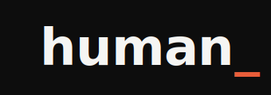

<div align="center">
  <br>
  <picture>
    <source media="(prefers-color-scheme: dark)" srcset="brand/logo-primary-dark.svg">
    <source media="(prefers-color-scheme: light)" srcset="brand/logo-primary-light.svg">
    
  </picture>
  <br><br>
  <strong>The first programming language designed for humans, not computers.</strong>
  <br>
  Write in structured English. Get production-ready applications.
  <br><br>
  <a href="https://github.com/barun-bash/human/releases/tag/v0.4.2"></a>&nbsp;
  <a href="LICENSE"></a>&nbsp;
  <a href="https://go.dev"></a>&nbsp;
  <a href="https://barun-bash.github.io/human/"></a>
  <br><br>
  <a href="https://barun-bash.github.io/human/">Website</a> &middot;
  <a href="https://barun-bash.github.io/human/getting-started.html">Getting Started</a> &middot;
  <a href="https://barun-bash.github.io/human/language-spec.html">Language Spec</a> &middot;
  <a href="https://barun-bash.github.io/human/roadmap.html">Roadmap</a> &middot;
  <a href="https://barun-bash.github.io/human/manifesto.html">Manifesto</a> &middot;
  <a href="https://barun-bash.github.io/human/contributing.html">Contributing</a> &middot;
  <a href="https://github.com/barun-bash/human/issues">Support</a>
  <br><br>
</div>

```
app TaskFlow is a web application

data User:
  has a name which is text
  has an email which is unique email
  has a password which is encrypted text

data Task:
  belongs to a User
  has a title which is text
  has a status which is either "pending" or "done"
  has a due date

page Dashboard:
  show a list of tasks sorted by due date
  each task shows its title, status, and due date
  clicking a task toggles its status
  if no tasks match, show "No tasks found"

api CreateTask:
  requires authentication
  accepts title and due date
  check that title is not empty
  create the task for the current user
  respond with the created task

authentication:
  method JWT tokens that expire in 7 days

build with:
  frontend using React with TypeScript
  backend using Node with Express
  database using PostgreSQL
```

That's a **complete, deployable application.** No semicolons. No imports. No framework knowledge required.

---

## What is Human?

Human is a natural language programming language that compiles structured English into production-ready, full-stack applications. The compiler is deterministic, target-agnostic, and enforces mandatory quality guarantees on every build.

- **English is the syntax** — if you can describe what you want, you can build it.
- **Design files are input** — feed it Figma files, images, or screenshots alongside your `.human` code.
- **Output is real code** — React, Angular, Vue, Node, Python, Go, and more.
- **Quality is mandatory** — tests, security audit, code quality, and QA trail are compiler-enforced. Cannot be skipped.
- **Compilation is deterministic** — same `.human` file always produces the same output. No randomness.
- **Ejectable** — generated code is clean, readable, and fully owned by you.
- **LLM-optional** — core compiler works offline with zero AI dependency. LLM connector available as an optional enhancement.

---

## How It Works

```
.human files + designs
         │
    ┌────▼────┐
    │  Lexer  │    Tokenizes English into structured tokens
    └────┬────┘
         │
    ┌────▼────┐
    │ Parser  │    Builds abstract syntax tree
    └────┬────┘
         │
    ┌────▼──────┐
    │ Analyzer  │  Validates semantics, resolves references
    └────┬──────┘
         │
    ┌────▼─────┐
    │ Intent   │   Framework-agnostic intermediate representation
    │ IR       │   (the heart of the compiler)
    └────┬─────┘
         │
    ┌────▼────────────────────┐
    │ Code Generators         │
    │ React │ Angular │ Vue   │
    │ Node  │ Python  │ Go    │
    │ Docker│ Terraform│ CI/CD│
    └────┬────────────────────┘
         │
    ┌────▼─────────┐
    │ Quality      │   Tests + Security + Lint + QA
    │ Engine       │   (mandatory on every build)
    └──────────────┘
         │
         ▼
    Production-ready code
```

The **Intent IR** is the key innovation — a typed, serializable, framework-agnostic representation that sits between your Human source and generated code. Write once, compile to any supported target.

---

## Quick Start

### Installation

```bash
# One-liner (macOS / Linux)
curl -fsSL https://raw.githubusercontent.com/barun-bash/human/main/install.sh | sh

# Homebrew
brew install barun-bash/tap/human

# Go install (requires Go 1.25+)
go install github.com/barun-bash/human/cmd/human@latest

# Build from source
git clone https://github.com/barun-bash/human.git
cd human && make install
```

### Usage

```bash
# Validate a .human file
human check examples/taskflow/app.human

# Compile to a full-stack project
human build examples/taskflow/app.human

# Run the generated project
cd .human/output && bash start.sh
```

---

## Supported Targets

| Layer | Implemented | Planned |
|-------|-------------|---------|
| **Frontend** | React, Angular, Vue, Svelte (all with TypeScript) | HTMX |
| **Backend** | Node + Express, Python + FastAPI, Go + Gin | Rust (Axum), Django |
| **Database** | PostgreSQL | MySQL, MongoDB, SQLite |
| **Infra** | Docker + Compose, Terraform (AWS ECS/RDS, GCP Cloud Run/SQL), GitHub Actions CI/CD | Kubernetes, Vercel, AWS Lambda |
| **Monitoring** | Prometheus rules, Grafana dashboards | — |
| **Integrations** | Stripe, SendGrid, AWS S3, OAuth (Google/GitHub), Slack | — |
| **Design Systems** | Material UI, Shadcn/ui, Ant Design, Chakra UI, Bootstrap, Tailwind CSS, Untitled UI | — |

---

## Mandatory Quality System

Every `human build` enforces all four pillars. These are not optional.

| Pillar | What it does |
|--------|-------------|
| **Automatic Tests** | Unit, integration, edge case, and frontend tests generated from your declarations. 90% minimum coverage. Build fails below threshold. |
| **Security Audit** | Dependency vulnerability scan, input sanitization, auth/authz checks, secret detection, infrastructure security review. |
| **Code Quality** | Consistent formatting, no dead code, duplication detection, performance pattern analysis, accessibility compliance. |
| **QA Trail** | Test plans from specs, execution records per build, regression tracking, full traceability from requirement to test to security to QA. |

---

## Project Structure

```
my-app/
├── app.human           # Main application definition
├── frontend.human      # UI pages, components, themes
├── backend.human       # APIs, data, logic, security
├── devops.human        # Architecture, CI/CD, deployment
├── integrations.human  # Third-party connections
├── designs/            # Figma files, images, screenshots
├── human.config        # Project configuration
└── .human/             # Compiler cache and IR
```

---

## CLI Reference

| Command | Description |
|---------|-------------|
| `human init <name>` | Create new project |
| `human build` | Compile `.human` files to target code |
| `human run` | Start development server |
| `human check` | Validate `.human` files |
| `human test` | Run all generated tests |
| `human audit` | Run security audit |
| `human deploy` | Deploy to configured environment |
| `human eject` | Export generated code as standalone project |
| `human explain [topic]` | Learn Human syntax by topic |
| `human syntax [--search term]` | Full syntax reference with search |
| `human fix [--dry-run] <file>` | Find and auto-fix common issues |
| `human doctor` | Check environment health |
| `human design <url\|image>` | Import from Figma design or screenshot |
| `human import openapi <file>` | Import from OpenAPI/Swagger JSON spec |
| `human feature <name>` | Create a feature branch |
| `human feature finish` | Merge feature branch back |
| `human release <version>` | Tag a release (vX.Y.Z) |
| `human release notes` | Generate changelog from commits |
| `human` (no args) | Launch interactive REPL with 38 commands |

The interactive REPL includes `/ask`, `/edit`, `/suggest` (LLM-powered), `/explain`, `/syntax`, `/fix`, `/doctor`, `/update` (self-update), `/build`, `/check`, tab completion, and command history.

See [CLI_REFERENCE.md](CLI_REFERENCE.md) for the full command reference, [GETTING_STARTED.md](GETTING_STARTED.md) for a tutorial, and [SYNTAX_QUICK_REFERENCE.md](SYNTAX_QUICK_REFERENCE.md) for a one-page cheat sheet.

---

## Project Status

**[v0.4.2 released](https://github.com/barun-bash/human/releases/tag/v0.4.2)** — Full-stack multi-framework output. 4 frontend frameworks, 3 backend languages, Terraform, monitoring, CI/CD, 7 design systems, 5 integrations, LLM connector with vision support, Figma design import, OpenAPI/Swagger import, git workflow commands, interactive REPL with self-update, VS Code extension, 13 example apps, language specification, LLM system prompt, plugin guide. 1,200+ tests across 41 packages. See the [Roadmap](https://barun-bash.github.io/human/roadmap.html) and [Changelog](CHANGELOG.md) for details.

---

## Documentation

| Document | Description |
|----------|-------------|
| [Getting Started](https://barun-bash.github.io/human/getting-started.html) | Build your first app in Human |
| [Language Spec](https://barun-bash.github.io/human/language-spec.html) | Complete grammar reference |
| [Architecture](ARCHITECTURE.md) | Compiler design and internals |
| [Roadmap](https://barun-bash.github.io/human/roadmap.html) | 52-week development plan |
| [Manifesto](https://barun-bash.github.io/human/manifesto.html) | Why Human exists |
| [Contributing](https://barun-bash.github.io/human/contributing.html) | How to contribute |
| [Changelog](CHANGELOG.md) | Release history |
| [Examples](examples/) | 13 sample applications (TaskFlow, Blog, E-commerce, SaaS, API-only, test-app, Recipes, Projects, Events, Fitness, Inventory, Figma-demo, Timekeeper-signin) |
| [Plugin Guide](docs/PLUGIN_GUIDE.md) | How to build a code generator |

---

## Building from Source

```bash
git clone https://github.com/barun-bash/human.git
cd human
make build      # build the compiler
make test       # run tests
make install    # install to /usr/local/bin
```

Requires Go 1.25+.

---

## Contributing

Human is open source under the MIT license. Contributions, ideas, and feedback are welcome. Read the [contributing guide](https://barun-bash.github.io/human/contributing.html) to get started.

---

<div align="center">
  <sub>MIT License &middot; Built with intent.</sub>
  <br><br>
  <em>Rust guarantees memory safety. TypeScript guarantees type safety. <strong>Human guarantees software quality.</strong></em>
</div>
